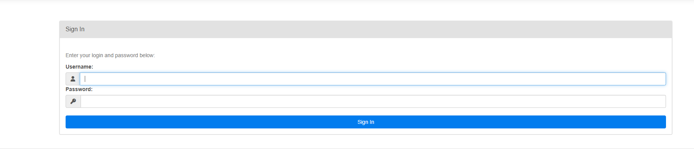
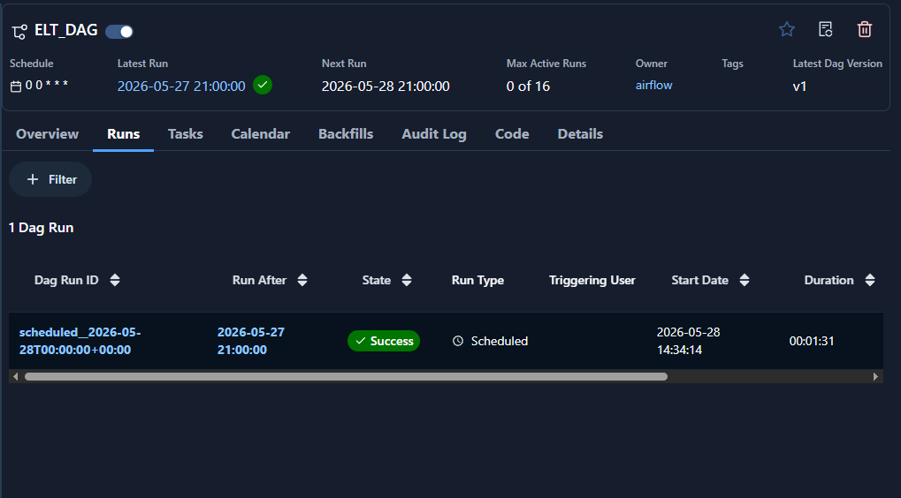
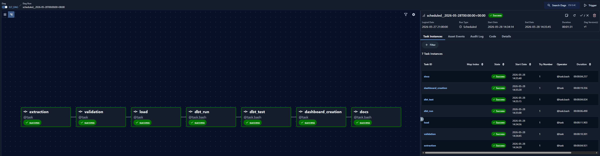
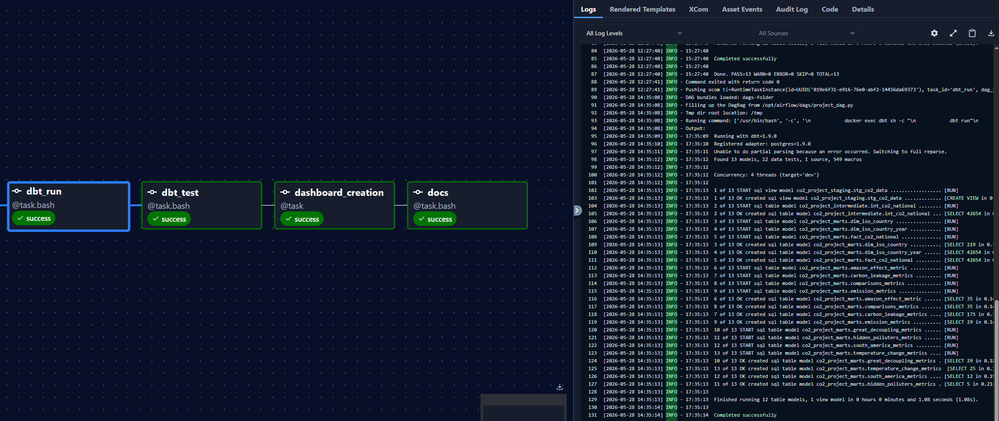
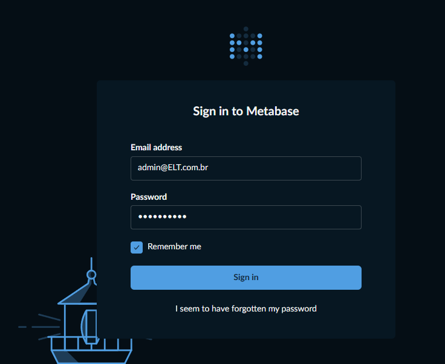
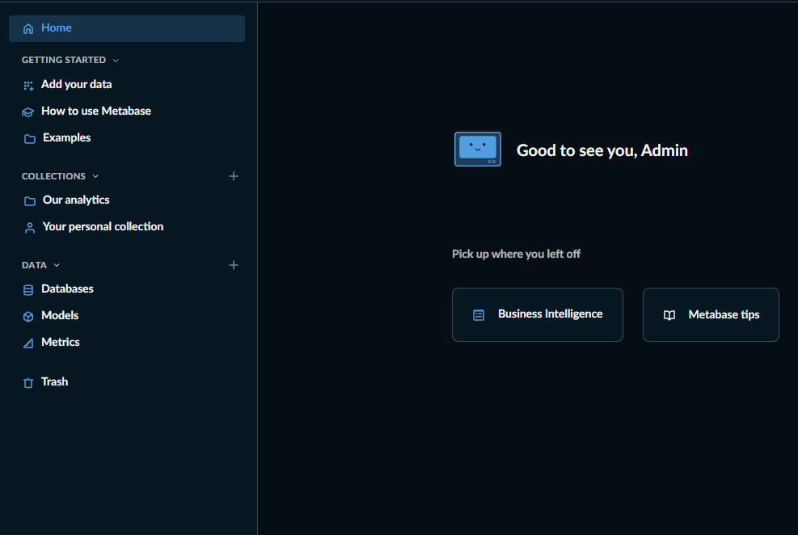
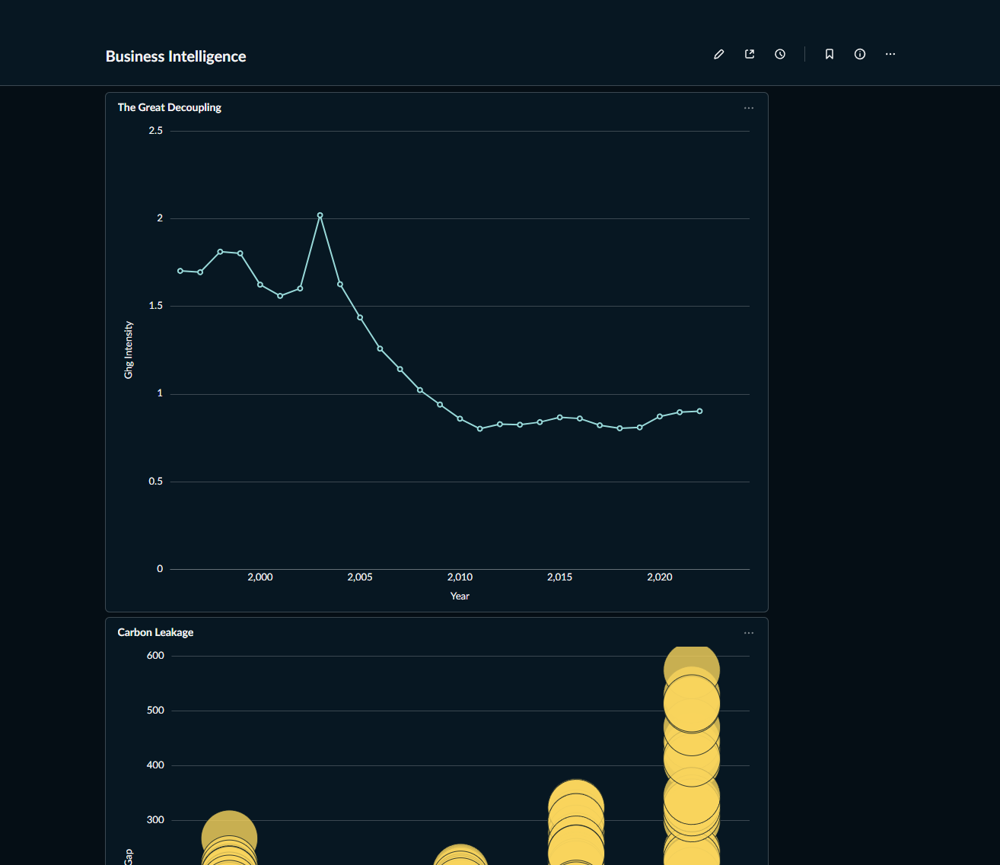

# ELT Medallion Pipeline Project
## CO2-owid data pipeline: Medallion Architecture with DBT and AIRFLOW

This project implements a ELT pipeline (Extract, Load, Transform) using **Apache Airflow** for pipeline orchestration **dbt (data build tool)** for the transformation layer, **Great Expectations** for data quality and **Metabase** as Business Intelligence tool.

---

## How to reproduce the environment

Follow the steps below, to reproduce the environment:

### 0. Requirements

This project depends on **Docker** functionality so you may need to install **Docker Desktop** - If you don't have it yet please follow this link: 'https://docs.docker.com/desktop/'.

### 1. Clone the repo
```bash
git clone git@github.com:GersonCJ/ELT_Medallion_Pipeline.git
cd ELT_Medallion_Pipeline
code .
```

After cloning the repo, make sure to create a new file named **.env** and place the contents of the **.env.example** inside. The project is also dependent on this file.

### 2. Run the Containers

The entire architecture is containerized, meaning that the application and all its dependencies are packed into an isolated, lightweight, and executable unit called a container, and specifically in the case of this project, each element of the application has its own Container running simultaneously and independently. The containerized services include Postgres, Metabase, Nginx server for documentation and Airflow for orchestration. 

To run the Containers, execute the command below: 
```bash
docker-compose up -d --build
```

If everything goes right, by the end of the execution, you should have something like the image below:

> **Image 1: Docker built successfully**


### 3. Watch the Airflow orchestration on the Airflow UI

Since the pipeline is orchestrated entirely via the **Apache Airflow**, after the containers finish starting up, you can access the Airflow UI to monitor the execution in real-time, without running any additional commands.

You can access the UI via the following link: **http://localhost:8081/dags/ELT_DAG**. 

If it is your first access you will probably encounter the screen below:

> **Image 2: Airflow UI - first access**


Just enter **username**: *airflow* and **password**: *airflow*

Once you are in, you should see the screen below:

> **Image 3: Airflow UI - ELT_DAG**


Now to monitor the execution and access the application logs, you should click the **Runs** button in the left tab. As you can see below:

> **Image 4: Airflow UI - Runs**


And then select the Dag Run ID available. It should take you to the last execution of the DAG. As you can see below:

> **Image 5: Airflow UI - ELT_DAG execution**


And by clicking each specific task you can see the application logs for that task. An example below:

> **Image 6: DBT run task Logs**


## Project Architecture
The pipeline was structured following Data Engineering best practices:

- Bronze Layer: Raw data loaded directly into Postgres.

- Silver Layer: Type cleaning, handling of null values, and standardization of ISO Codes.

- Gold Layer (Marts): Business aggregations, including Per Capita Emission and Carbon Intensity metrics, using reusable Macros.

## Documentation and Lineage

As you can probably see, the final Airflow task is called **docs**. There you will find three new links you can follow to see the project's automatically generated documentation. We'll go through each one of them now.

The documentation automatically generated by dbt allows auditing the data dictionary and understanding the origin of each metric.

1. Documentation Screen
- Available at: http://localhost:8181

Here are listed all the columns, descriptions, and tests applied to the data models.

> **Image 7: dbt docs - Localhost:8181**


2. Data Lineage (Lineage Graph)
The lineage graph visualizes the data flow from the sources to the final analysis tables (marts).

> **Image 8: Lineage**


## Data Quality (Great Expectations)
Before the transformations, the data passes through a quality validation layer (GX) to ensure that the schema and data types are correct.

- Available at: http://localhost:8080

> **Image 9: Great Expectations**


## Business Intelligence (Metabase)
The Gold layer tables are consumed by Metabase for the creation of executive dashboards, allowing the analysis of the correlation between GDP growth and greenhouse gas emissions.

- Available at: http://localhost:3000

The Dashboard on the Metabase Application is automatically created via code. When you first enter, you will need to inform **username**: *admin@ELT.com.br* and **password**: *metabase01*. As you can see below:

> **Image 10: Metabase Sign in screen**


Then you should land on the metabase home page:

> **Image 11: Metabase Homepage**


You'll find the dashboard under **Our analytics** -> **Business Intelligence**

> **Image 12: Dashboard metabase**


## Conclusion and Singular Tests
The project includes singular tests (custom SQL) to identify anomalies, such as the case of negative emissions identified in Angola's historical data, ensuring the reliability of the generated insights.

**Developed by:** Gerson Chadi Junior
